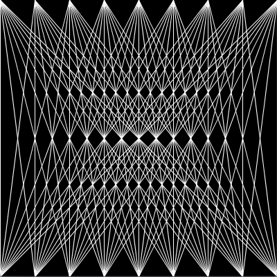

# Yksinkertaista silmukoilla tehtyä taidetta
Silmukoilla voi automatisoida toistuvia asioita. Esimerkiksi shakkiruudukon voi piirtää seuraavalla rakenteella:

```processing
void setup() {
  size(400, 400);
  background(0);
  stroke(255);
  int koko = 50;
  for(int i = 0; i<8; i++){
    for(int j = 0; j<8; j++){
        if( (i + j) % 2 ==0){
          square(i * koko, j * koko, koko);
        }
    }
  }
}

void draw() {

}
```
Koodissa on kaksi sisäkkäistä silmukkaa. Lisäksi katsotaan, onko väri musta vai valkoinen muuttujien i ja j summasta.

Muita esimerkkejä:

```processing
void setup() {
  size(400, 400);
  background(0);
  stroke(255);
  int koko = 50;
  for(int i = 0; i<9; i++){
    for(int j = 0; j<9; j++){
        line(i*koko,0,j*koko,400);
    }
  }
}

void draw() {
}
```
Tämä koodi piirtää verkon:


